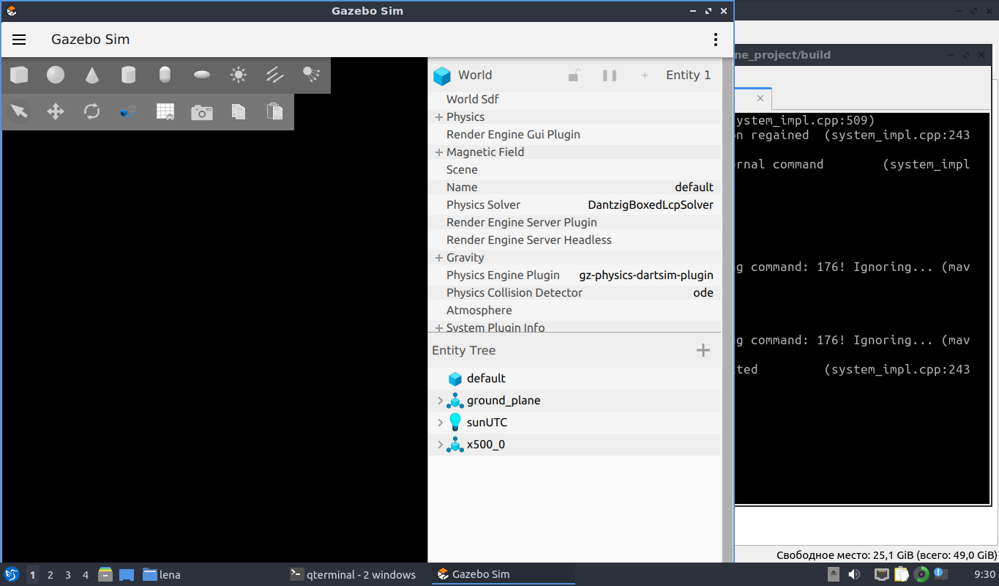

# Drone Altitude Control

Проект для управления высотой квадрокоптера через MAVSDK с использованием ПИД-регулятора. 
Выполнен в ВМ Lubuntu 22.01.

## Требования
- C++17
- MAVSDK (v2.x)
- CMake 3.10+

## Сборка
```bash
mkdir build && cd build
cmake ..
make
```

# Результат программы:

## drone_project:
lena@lena-virtualbox:~/drone_project/build$ make
lena@lena-virtualbox:~/drone_project/build$ ./drone_project udp://:14540 100
[09:12:43|Info ] MAVSDK version: v2.12.12 (mavsdk_impl.cpp:26)
The flight controller is successfully connected!
Waiting connection...
[09:12:43|Info ] New system on: 127.0.0.1:14580 (with system ID: 1) (udp_connection.cpp:178)
[09:12:43|Debug] New system ID: 1 Comp ID: 1 (mavsdk_impl.cpp:750)
[09:12:43|Debug] Component Autopilot (1) added. (system_impl.cpp:366)
[DroneControl] dt= 0.10 с

=== Starting mission ===
Target altitude: 100.00 m

Waiting for drone to be healthy...
[09:12:44|Warn ] Vehicle type changed (new type: 2, old type: 0) (system_impl.cpp:217)
[09:12:44|Debug] Discovered 1 component(s) (system_impl.cpp:509)
[09:12:44|Warn ] Received ack for not-existing command: 176! Ignoring... (mavlink_command_sender.cpp:288)
[Arm] System armed successfully!
[Arm] System connected ofboard successfuly
Armed
[Takeoff] Take off to 100.00 m
[09:12:44|Warn ] Received ack for not-existing command: 176! Ignoring... (mavlink_command_sender.cpp:288)
[Takeoff] Height: 22.32 м, error: 77.68 m
[Takeoff] Height: 28.27 м, error: 71.73 m
[Takeoff] Height: 35.20 м, error: 64.80 m
[Takeoff] Height: 41.97 м, error: 58.03 m
[Takeoff] Height: 48.77 м, error: 51.23 m
[Takeoff] Height: 56.00 м, error: 44.00 m
[Takeoff] Height: 62.23 м, error: 37.77 m
[Takeoff] Height: 66.96 м, error: 33.04 m
[Takeoff] Height: 72.80 м, error: 27.20 m
[Takeoff] Height: 78.56 м, error: 21.44 m
[Takeoff] Height: 85.28 м, error: 14.72 m
[Takeoff] Height: 90.62 м, error: 9.38 m
[Takeoff] Height: 94.90 м, error: 5.10 m
[Takeoff] Height: 97.83 м, error: 2.17 m
[Takeoff] Height: 99.65 м, error: 0.35 m
[Takeoff] Height: 99.86 м, error: 0.14 m
[Takeoff] Target height: 100.00 m is reached!
Takeoff complete
[Hold] Hold height 100.00 m during 10.00 sec
[Hold] 10%, высота: 99.63 м
[Hold] 20%, высота: 99.58 м
[Hold] 30%, высота: 99.60 м
[Hold] 40%, высота: 99.63 м
[Hold] 50%, высота: 99.68 м
[Hold] 60%, высота: 99.70 м
[Hold] 70%, высота: 99.77 м
[Hold] 80%, высота: 99.86 м
[Hold] 90%, высота: 99.91 м
[Hold] Hold height completed
Hold complete
[Land] Landing...
[Land] Height: 94.96 m
[Land] Height: 87.59 m
[Land] Height: 77.73 m
[Land] Height: 67.77 m
[Land] Height: 57.49 m
[Land] Height: 50.32 m
[Land] Height: 45.52 m
[Land] Height: 39.10 m
[Land] Height: 31.04 m
[Land] Height: 26.25 m
[Land] Height: 20.83 m
[Land] Height: 14.57 m
[Land] Height: 5.38 m
[Land] System id landed
[09:14:12|Warn ] Received ack for not-existing command: 176! Ignoring... (mavlink_command_sender.cpp:288)
[Disarm] Offboard stoped successuly
Waiting for land to be detected...
[09:14:13|Debug] MAVLink: info: Landing detected         (system_impl.cpp:243)
[09:14:14|Debug] MAVLink: info: Disarmed by external command     (system_impl.cpp:243)
[Disarm] System disarmed successfuly
Landed
Waiting for land to be detected...
[Disarm] System disarmed successfuly
Disarmed

=== Mission completed successfully ===

## PX4-Autopilot:
lena@lena-virtualbox:~$ cd PX4-Autopilot/
lena@lena-virtualbox:~/PX4-Autopilot$ make px4_sitl gz_x500
[0/1] cd /home/lena/PX4-Autopilot/bui...opilot/build/px4_sitl_default/bin/px4

______  __   __    ___ 
| ___ \ \ \ / /   /   |
| |_/ /  \ V /   / /| |
|  __/   /   \  / /_| |
| |     / /^\ \ \___  |
\_|     \/   \/     |_/

px4 starting.

INFO  [px4] startup script: /bin/sh etc/init.d-posix/rcS 0
INFO  [init] found model autostart file as SYS_AUTOSTART=4001
INFO  [param] selected parameter default file parameters.bson
INFO  [param] importing from 'parameters.bson'
INFO  [parameters] BSON document size 377 bytes, decoded 377 bytes (INT32:15, FLOAT:4)
INFO  [param] selected parameter backup file parameters_backup.bson
INFO  [dataman] data manager file './dataman' size is 1208528 bytes
INFO  [init] Gazebo simulator 8.10.0
INFO  [init] Starting gazebo with world: /home/lena/PX4-Autopilot/Tools/simulation/gz/worlds/default.sdf
INFO  [init] Starting gz gui
INFO  [init] Waiting for Gazebo world...
INFO  [init] Gazebo world is ready
INFO  [init] Spawning Gazebo model
Warning [Utils.cc:132] [/sdf/model[@name="x500_base"]/link[@name="base_link"]/sensor[@name="air_pressure_sensor"]/gz_frame_id:/home/lena/PX4-Autopilot/Tools/simulation/gz/models/x500_base/model.sdf:L219]: XML Element[gz_frame_id], child of element[sensor], not defined in SDF. Copying[gz_frame_id] as children of [sensor].
Warning [Utils.cc:132] [/sdf/model[@name="x500_base"]/link[@name="base_link"]/sensor[@name="magnetometer_sensor"]/gz_frame_id:/home/lena/PX4-Autopilot/Tools/simulation/gz/models/x500_base/model.sdf:L233]: XML Element[gz_frame_id], child of element[sensor], not defined in SDF. Copying[gz_frame_id] as children of [sensor].
Warning [Utils.cc:132] [/sdf/model[@name="x500_base"]/link[@name="base_link"]/sensor[@name="imu_sensor"]/gz_frame_id:/home/lena/PX4-Autopilot/Tools/simulation/gz/models/x500_base/model.sdf:L259]: XML Element[gz_frame_id], child of element[sensor], not defined in SDF. Copying[gz_frame_id] as children of [sensor].
Warning [Utils.cc:132] [/sdf/model[@name="x500_base"]/link[@name="base_link"]/sensor[@name="navsat_sensor"]/gz_frame_id:/home/lena/PX4-Autopilot/Tools/simulation/gz/models/x500_base/model.sdf:L311]: XML Element[gz_frame_id], child of element[sensor], not defined in SDF. Copying[gz_frame_id] as children of [sensor].
INFO  [gz_bridge] world: default, model: x500_0
INFO  [init] Setting camera to follow x500_0
INFO  [lockstep_scheduler] setting initial absolute time to 3160000 us
INFO  [init] Camera follow offset set to -2.0, -2.0, 2.0
INFO  [commander] LED: open /dev/led0 failed (22)
WARN  [health_and_arming_checks] Preflight Fail: ekf2 missing data
WARN  [health_and_arming_checks] Preflight Fail: No connection to the GCS
INFO  [tone_alarm] home set
INFO  [uxrce_dds_client] init UDP agent IP:127.0.0.1, port:8888
INFO  [mavlink] mode: Normal, data rate: 4000000 B/s on udp port 18570 remote port 14550
INFO  [mavlink] mode: Onboard, data rate: 4000000 B/s on udp port 14580 remote port 14540
INFO  [mavlink] mode: Onboard, data rate: 4000 B/s on udp port 14280 remote port 14030
INFO  [mavlink] mode: Gimbal, data rate: 400000 B/s on udp port 13030 remote port 13280
INFO  [logger] logger started (mode=all)
INFO  [logger] Start file log (type: full)
INFO  [logger] [logger] ./log/2026-02-17/06_12_22.ulg
INFO  [logger] Opened full log file: ./log/2026-02-17/06_12_22.ulg
INFO  [mavlink] MAVLink only on localhost (set param MAV_{i}_BROADCAST = 1 to enable network)
INFO  [mavlink] MAVLink only on localhost (set param MAV_{i}_BROADCAST = 1 to enable network)
INFO  [px4] Startup script returned successfully
pxh> WARN  [health_and_arming_checks] Preflight Fail: No connection to the GCS                                                                            
WARN  [health_and_arming_checks] Preflight Fail: No connection to the GCS
INFO  [mavlink] partner IP: 127.0.0.1
INFO  [commander] Ready for takeoff!
INFO  [commander] Armed by external command
INFO  [tone_alarm] arming warning
INFO  [commander] Takeoff detected
NodeShared::Publish() Error: Interrupted system call
WARN  [failsafe] Failsafe activated
INFO  [tone_alarm] battery warning (fast)
INFO  [navigator] RTL: start return at 21 m (21 m above destination)
INFO  [navigator] RTL: land at destination
NodeShared::Publish() Error: Interrupted system call
ERROR [vehicle_imu] 0 - gyro 1310988 timestamp error timestamp_sample: 59888000, previous timestamp_sample:ERROR [vehicle_imu] 0 - accel 1310988 timestamp error timestamp_sample: 59888000, previous timestamp_sampleINFO  [commander] Landing detected                                                            
INFO  [commander] Disarmed by external command
INFO  [tone_alarm] notify neutral
INFO  [logger] closed logfile, bytes written: 21197047
INFO  [commander] Connection to ground station lost
WARN  [health_and_arming_checks] Preflight Fail: No connection to the GCS

Правда отображение симмуляции в газебо не видно, возможно не хватает оперативки на ВМ.
